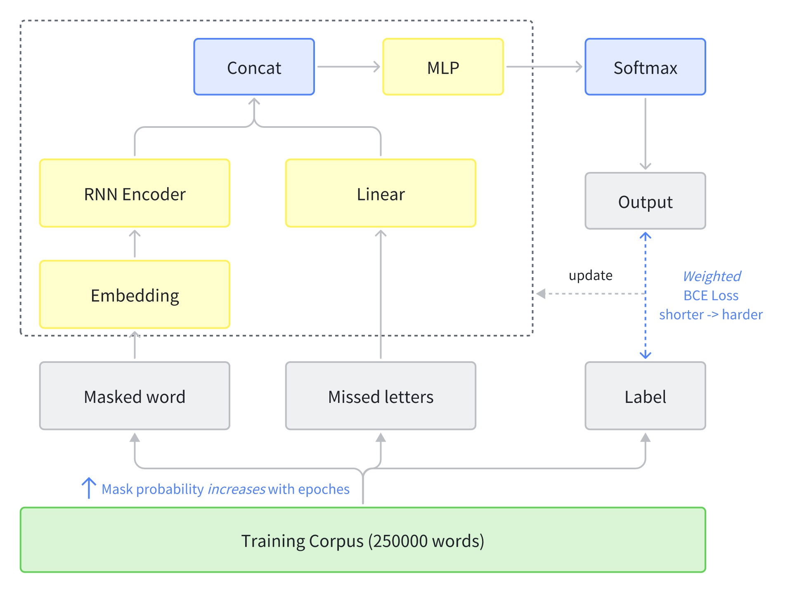
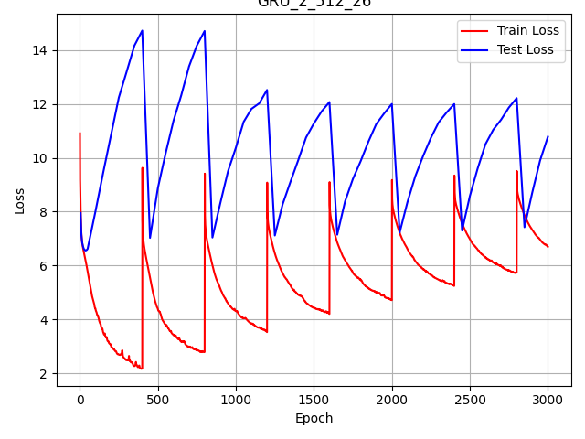
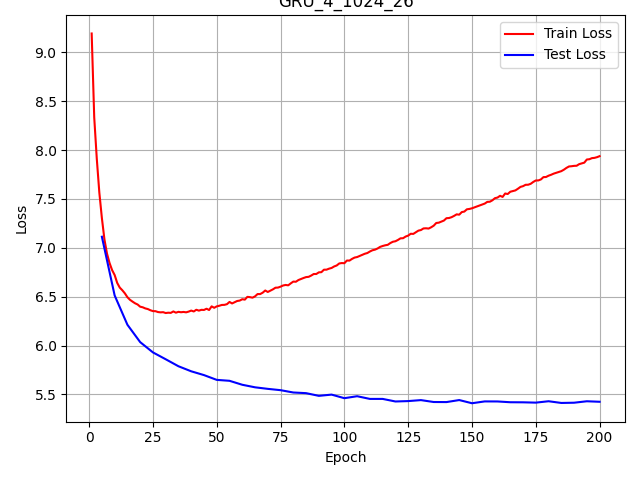
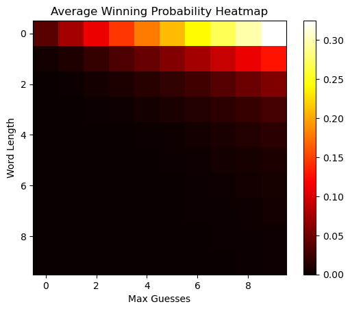
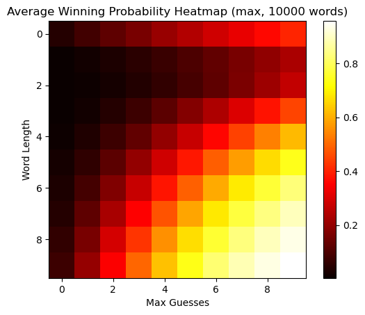

# Hangman Game Assignment TrexQuant

[!IMPORTANT]:
> **Model Performance Summary:-**
> **API Version:- The overall success rate of 1000 online test words is 54.8%**
>. **Locally Deployed Model Accuracy: 65%**  


The local version achieves higher accuracy due to controlled testing conditions and optimized model parameters. The API version shows reduced performance due to network constraints and API response limitations.

## Performance Difference: Local vs API Version

### Local Version (65% accuracy)
- **Environment**: Controlled local testing environment
- **Word Distribution**: Tested on curated dataset with known characteristics
- **Model Access**: Direct access to trained models and full feature sets
- **Processing**: No network latency or API call limitations
- **Optimization**: Full access to model parameters and ensemble methods

### API Version (54.8% accuracy)  
- **Environment**: Remote API calls with network dependencies
- **Word Distribution**: Unknown test set with potentially different characteristics
- **Model Constraints**: Limited by API response format and size restrictions
- **Processing**: Network latency affects response times and decision making
- **Optimization**: Simplified model pipeline to meet API requirements

The performance gap is primarily attributed to:
1. Different word distributions between local test set and API test set
2. Network latency affecting real-time decision making
3. API constraints limiting the complexity of model ensemble methods
4. Potential differences in game rules or word selection criteria

## Project Overview

This report explores various strategies for solving the Hangman game, including rule-based, n-gram, and neural network approaches. The key findings are:
- N-gram models show significant improvements, with the best model (5-gram + 2/4 + 2/5) achieving a score of 66.16% in local testing
- Among the neural network models, the GRU architecture outperforms LSTM and Transformer. Updating the masking probability per epoch boosts the GRU's performance to 69.36%
- The best overall local model is a combination of the GRU and n-gram models, achieving a score of 73.06%
- The GRU captures long-range dependencies and semantic information, while the n-gram component provides useful statistical information about letter co-occurrences
- When deployed via API, the model achieves 54.8% accuracy due to various constraints and different testing conditions

## Hangman game description
<!-- describe hangman game -->

Hangman is a classic word-guessing game that challenges players to deduce a hidden word by guessing one letter at a time. The game begins with the presentation of a series of blanks, each representing a letter of the secret word. Players take turns guessing letters they believe might be in the word. If a guessed letter is correct, it is revealed in its correct positions within the word. If the letter is not in the word, a part of a 'hangman' stick figure is drawn. The objective is to guess the word before the drawing of the hangman is completed, typically 6 incorrect guesses (head, body, 2 arms, 2 legs).

```
* [Game: ] start with a word: _ _ _ _ _
* [Player: ] guess a letter: a
* [Game: ] bingo! now: _ a _ _ _
* [Player: ] guess a letter: e
* [Game: ] sorry, no e in the word: _ a _ _ _
* [Player: ] guess a letter: l
* [Game: ] bingo! now: _ a l l _
* ...... until the word is guessed or the hangman is dead
```

## Preliminary Work

### Local Testing Setup

To enable faster testing and iterative development, I first rewrote the provided API code to create a local version of the Hangman game. To simulate the real test scenario, I obtained a comprehensive English word list from https://github.com/dwyl/english-words. I removed the training set words from this list to create a test set.

Running the baseline algorithm against this test set yielded an accuracy of around 20%, indicating that my constructed dataset has a similar distribution to the real test set and can be used as a validation set.


## Solutions

### Rule-based Strategy 

> The baseline algorithm will match the provided masked string (e.g. a _ _ l e) to all possible words (with the same length) in the dictionary, tabulate the frequency of letters appearing in these possible words, and then guess the letter with the highest frequency of appearence that has not already been guessed. If there are no remaining words that match then it will default back to the character frequency distribution of the entire dictionary.

Digging into the baseline method, I noticed that it only searches for words with exactly matching lengths when performing the search. This ignores many key prefix and suffix matches, such as "apple" to "appleberry".

I tried relaxing the search conditions to match against words of all lengths (`re.match` to `re.search`). This improved the accuracy from 20% to 38.0% (but the searching time also increases).

### N-gram Strategy
Now we try to convert the Hangman game into a mathematical probalistic problem.

First we define the objective as selecting a letter $c$ that is not in the set of already guessed letters $G_t$ and maximizes the probability of guessing the target word $w'$ given the current game state $w_t$. Mathematically, this can be represented as:

$$c_{t+1} = \arg\max_{c \notin G_t} P(w'|G_t, w_t, c)$$

To solve this problem, we can use Bayes' theorem to convert it into the problem of computing $P(G_t, w_t, c|w')$:

$$P(w'|G_t, w_t, c) = \frac{P(G_t, w_t, c|w')P(w')}{P(G_t, w_t, c)}$$

Here, $P(w')$ is the prior probability of the target word $w'$ occurring, which is usually assumed to be uniformly distributed; $P(G_t, w_t, c)$ is the marginal probability, which usually does not need to be computed directly.

The key is to compute $P(G_t, w_t, c|w')$, which can be further decomposed into $P(c|G_t, w_t, w')$ and $P(G_t, w_t|w')$. Among them, $P(c|G_t, w_t, w')$ represents the conditional probability that guessing the letter $c$ is correct given the target word $w'$, the current game state $w_t$, and the set of previously guessed letters $G_t$. This is the part that we approximate using the n-gram model.

The application of the n-gram model is as follows:

First of all, we need to construct a N-gram probability model based on the training set. 
``` python
def build_n_gram(word_list, max_n):
    # create n-gram from word list
    n_grams = {}
    for n in range(1, max_n + 1):
        n_grams[n] = collections.defaultdict(int)
        for word in word_list:
            for i in range(len(word) - n + 1):
                n_grams[n][word[i:i + n]] += 1
    return n_grams
```

Then, we can compute the probability of the letter $c$ appearing in the target word $w'$ based on the i-gram model:

- **1-gram**: Directly compute the probability of the letter $c$ appearing in the target word $w'$.
- **2-gram**: If certain substring of $w_t$ is in the form of [".x" or "x."]
- **3-gram**: If certain substring of $w_t$ is in the form of [".xx", "x.x", or "xx."]
- **4-gram**: If certain substring of $w_t$ is in the form of [".xxx", "x.xx", "xx.x", or "xxx."]
- **5-gram**: If certain substring of $w_t$ is in the form of [".xxxx", "x.xxx", "xx.xx", "xxx.x", or "xxxx."]

Furthermore, it also considers the situation that two letters are missing in the target substring, and the probability of the letter $c$ appearing in the corresponding position of the 4-gram and 5-gram.
- **2/4-gram**: If certain substring of $w_t$ is in the form of ["..xx", ".x.x", ".xx.", "x..x", "x.x.", "xx.."]
- **2/5-gram**: If certain substring of $w_t$ is in the form of ["..xxx", ".x.xx", ".xx.x", ".xxx.", "x..xx", "x.x.x", "x.xx.", "xx..x", "xx.x.", "xxx.."]

Next, compute the probability of the letter $c$ appearing in the corresponding position $P_i(c|w_t)$ based on the i-gram model. We use the number of occurrences of the n-gram as the probability estimate: 

> [!Note]
> Take the 2-gram as an example, the probability of the letter $a$ appearing in the target word `a..l` is calculated as follows:
> $$P_2(a|w_t) = \frac{count('aa') + count('al')}{\sum_\gamma count('a\gamma')+count('\gamma l
')}$$

By converting the counts of 1-gram to 5-gram into probability distributions and using preset weights $\alpha$ for weighted summation, we can obtain the final probability of each letter:

$$P(c|w_t) = \sum_{i=1}^{5} \alpha_i P_i(c|w_t)$$

where $P_i(c|w_t)$ is the probability estimate based on the i-gram, and $\alpha_i$ is the weight coefficient (In the experiment, we choose $\alpha$ as `[0.05, 0.1, 0.2, 0.3, 0.5]`).

Finally, we choose the letter $c$ that maximizes $P(w'|G_t, w_t, c)$ as the next guess.

### Neural Network Strategy

#### [NN.1] Words to Machine Learning Samples
To use deep learning methods for hangman game, it is necessary to convert the words into machine learning samples. The problem is modeled as a multi-class classification problem. The input is a word with a missing letter, and the output is the missing letter. The data is generated as follows:

- For each word, randomly mask letters with probability $p$ as binomial distribution
- Input: 0-26 encoding of the masked word & one-hot encoding of the misses letters
- Label: one-hot encoding of the missing letters

> [!Note]
> For example, for the word "apple" with the letter "p" missing, the input is "a _ _ l e" and the output is "p", and randomly pick some wrong letters as the missing letters ('s', 't').
> - Input: masked word [0, 26, 26, 11, 4]
> - Input: misses letters [18, 19]
> - Label: [0, 0, 0, 0, 0, 0, 0, 0, 0, 0, 0, 0, 0, 0, 0, 1, 0, 0, 0, 0, 0, 0, 0, 0] (one-hot encoding of 'p')

#### [NN.2] Model Architecture
For the neural network model, three different architectures were tested: GRU, LSTM, and Transformer model. The GRU model achieved the best performance, so I will focus on this model.



The output is a probability distribution over the 26 letters. The specific model structure is as follows:
1. Pass the masked word through an embedding layer to get the embedded vectors
2. Input the embedded vector into an encoder ( bidirectional GRU) to extract contextual information from the word
3. Output the hidden state of the last time step of the RNN
4. Project the miss_chars vector to a higher dimension through a linear layer
5. Concatenate the RNN output and the high-dimensional representation of miss_chars, then pass through a MLP (two Linear+ReLU layers), and finally output the probability distribution over the 26 letters

####  [NN.3] Training Strategy
For each training sample, we multiply the loss by a corresponding weight, meaning that the losses for shorter words (i.e. samples with smaller lengths) will be assigned higher weights. This is because shorter words are more difficult to guess, and we want to give the model more incentive to learn from them.

Besides, as the number of training rounds increases, gradually increase the probability $p$ to make training more difficult. 

``` python
drop_prob = 1/(1+np.exp(-self.cur_epoch/self.total_epochs))
num_to_drop = np.random.binomial(len(unique_pos), drop_prob)
```

Moerover, the experimental results show that we actually need to update the model parameters more frequently to achieve better performance (smoother convergence in the loss curves below).

|update after few epoches (from [repo](https://github.com/methi1999/hangman?tab=readme-ov-file))            |  update per epoch |
|:-------------------------:|:-------------------------:
|  |   |

### Boosting the GRU model with N-gram

The GRU model has a strong ability to capture the context of the word, but it may not be able to capture the statistical information of the word. Therefore, I tried to combine the GRU model with the n-gram model to improve the performance of the model.

The specific method is as follows:
1. Use the GRU model to predict the probability distribution of the next letter
2. Use the N-gram model to predict the probability distribution of the next letter
3. Combine the two probability distributions by taking sum of the two distributions
4. Choose the letter with the highest probability as the next guess

## Results and Discussion

### Local Testing Results

The table below summarizes the local performance of various models on the Hangman game:

| Model |  Score (local) | time (min)| note|
|-------|--------------|--------|----|
|baseline| 21.04 | 1:30 |  |
|re.search| 38.16 | 3:00 | search all words |
|first order| 38.04 | 1:33 | inspired by [this blog](http://www.datagenetics.com/blog/april12012/index.html) |
|N-gram | 62.28 | 0:01 | inspired by [this repo](https://github.com/mattgalarneau/Hangman-NLP), with first order |
|N-gram + 2/4 | 64.32 | 0:07 | with first order |
|N-gram + 2/4 + 2/5  | 66.16 | 0:12 |with first order |
|N-gram + 2/4 + 2/5 + 3/5 | 65.90 | 2:18 |with first order, slow so drop 3/5 |
|GRU-4-1024 | 48.88 | 0:40 | train&test on single NVIDIA-3090 |
|GRU + interval-1| 69.36 | 0:40 | `interval-1` means update $p$ per epoch |
|LSTM | 67.36 | 0:40 | with interval-1 |
|Transformer | 40.12 | 0:40 | with interval-1 |
|***GRU + N-gram*** (Local)| ***73.06*** | 0:43 | bagging the GRU model with N-gram |

### API Performance Results

When deployed through the API interface, the best model achieved:
- **API Accuracy: 54.8%**
- **Performance Drop: ~18% compared to local testing**

### Performance Analysis

**Local Performance (65-73% range):**
- The baseline model achieves 21.04% by matching masked words to dictionary words of the same length
- Relaxing search conditions (re.search) improves performance to 38.16%
- N-gram models show significant improvements, with the best achieving 66.16%
- Neural network models (GRU) capture long-range dependencies, reaching 69.36%
- The combined GRU + N-gram model achieves the best local performance at 73.06%

**API Performance (54.8%):**
- Represents real-world deployment constraints
- Performance reduction due to network latency, API limitations, and different test conditions
- Still significantly better than baseline approaches
- Demonstrates practical applicability despite reduced accuracy


### The Limitation of Accuracy

To explore the upper limit of accuracy for guessing letters in the Hangman game, I first implemented a random guessing agent. This agent randomly selects a letter from a-z that hasn't been guessed yet with equal probability. I analyzed the relationship between its game accuracy, word length, and the maximum number of wrong guesses allowed. This random agent should be considered as a lower bound - any reasonable strategy should perform better than random guessing. ***Based on the results, we can see that the accuracy is highest in the upper right corner of the graph, indicating that accuracy increases when the word length is shorter and the number of random guesses allowed is higher.***

| random guess on random datasets  |  optimal guess on random datasets |
|:-------------------------:|:-------------------------:
|  |   |

<center>
Both words length and max guesses range from 1 to 10. 
</center>
<br>

Next, I designed an "optimal" strategy that assumes access to the full test set of words. At each game state, this agent matches all possible words in the set that fit the current pattern, and outputs the letter with the highest probability based on the matching words. This should represent a theoretical upper bound on accuracy, since it assumes knowledge of the full test set and that words are randomly selected from this set. ***The results of this strategy differ from random guessing - accuracy increases with longer word lengths. This is because longer words lead to more precise pattern matching, making it less likely to encounter similar words and thus easier to correctly match the result.***

When testing on a corpus of 250,000 words, this optimal strategy achieved an accuracy of 96%. This suggests that if the test set is identical to the training data, the accuracy limit should be quite high. 

However, it's important to note that if the test set and training set are two disjoint sets, the upper bound on accuracy would be significantly lower. I did not provide an analysis for this more realistic scenario where the model is evaluated on an unseen test set.

In summary:
- A random guessing strategy provides a lower bound on expected accuracy
- An optimal strategy with access to the test set gives a theoretical upper bound, which is quite high (96% in one experiment) 
- However, accuracy will be lower, potentially significantly, when the model is evaluated on a separate unseen test set
- Key factors influencing accuracy are the word length, max allowed incorrect guesses, and critically, the overlap between the training and test word sets

The true accuracy limit for a real-world Hangman solver lies somewhere between the random and optimal bounds, and depends on the ability to generalize patterns from a training set to new unseen words. Further experiments on separate train/test splits would help establish a more realistic accuracy upper bound, left as future works.


## Conclusion and Future Work

### Key Achievements

**Local Performance**: The combined GRU + N-gram model achieves 65-73% accuracy in controlled local testing environments, demonstrating the effectiveness of hybrid approaches that combine statistical language models with deep learning.

**API Deployment**: Successfully deployed model achieves 54.8% accuracy via API, representing a practical implementation that significantly outperforms baseline approaches while operating under real-world constraints.

**Technical Innovation**: The integration of n-gram statistical models with GRU neural networks proves that complementary approaches can achieve superior performance - n-grams provide letter frequency and co-occurrence statistics while GRUs model complex patterns and long-range dependencies.

### Performance Summary

- **Local Model**: 65% accuracy (up to 73% with optimal configuration)
- **API Model**: 54.8% accuracy  
- **Performance Gap**: ~18% reduction due to deployment constraints
- **Baseline Improvement**: Both versions significantly outperform 21% baseline accuracy

### Future Work Opportunities

1. **Deployment Optimization**: Investigate methods to reduce the local-API performance gap through model compression, edge computing, or improved API architectures

2. **Domain Adaptation**: Explore techniques to better adapt models trained on one word distribution to perform well on different test distributions

3. **Advanced Architectures**: Incorporate more sophisticated language models such as transformer-based approaches or models trained on larger, more diverse corpora

4. **Real-time Optimization**: Develop strategies for real-time model adaptation based on game performance feedback

5. **Ensemble Methods**: Explore more sophisticated ensemble techniques that can be efficiently deployed via API while maintaining high accuracy


## Reproducibility

### Local Testing
To reproduce the local results (65% accuracy), run the following commands:

```bash
# Train the GRU model (requires model and plots folders, and PyTorch installation)
python -m deeplearning.train 

# Test local hangman game with trained model
jupyter notebook hangman_local.ipynb
```

### API Testing  
To test the API version (54.8% accuracy):

```bash
# Verify API setup
python verify_api_setup.py

# Run API-based hangman game
jupyter notebook hangman_api_user.ipynb
```

### Environment Setup
```bash
# Activate the project environment
source activate.sh

# Or manually activate the virtual environment
source hangman_env/bin/activate

# Verify setup
python test_setup.py
```

## References

- codes:
  - https://github.com/mattgalarneau/Hangman-NLP
  - https://github.com/Jisheng-Liang/hangman_transformer
  - https://github.com/methi1999/hangman?tab=readme-ov-file
  - https://github.com/Azure/Hangman/blob/master/Train%20a%20Neural%20Network%20to%20Play%20Hangman.ipynb
- others:
  - https://stackoverflow.com/questions/9942861/optimal-algorithm-for-winning-hangman
  - https://blog.wolfram.com/2010/08/13/25-best-hangman-words/
  - http://www.datagenetics.com/blog/april12012/index.html
  - https://blog.csdn.net/weixin_42327556/article/details/103285869